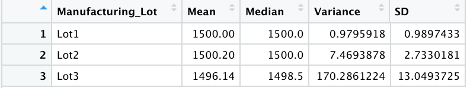
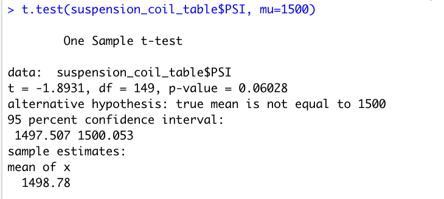
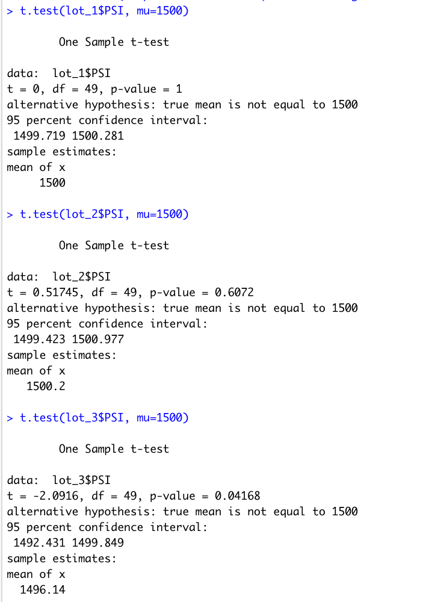

# MechaCar_Statistical_Analysis

## Deliverable 1: Linear Regression to Predict MPG
### Requirements
The MechaCar_mpg.csv is a dataset that shows the results of an mpg test done on 50 MechaCars prototypes. Vehicle length, vehicle weight, spoiler angle, drivetrain, and ground clearance are different metrics that were collected for each vehicle to help MechaCar understand the car performance. In this analysis, the goal is to understand if/ how those metrics can predict mpg.
### Results
 

From the above screenshot the Linear Regression Model is: 
mpg = (6.267)vehicle_length + (0.0012)vehicle_weight + (0.0688)spoiler_angle + (3.546)ground_clearance + (-3.411)AWD + (-104.0)

### Inference
- According to the output, vehicle length and ground clearance are most likely to provie a non-random amount of variance to the mpg values (we can see this from the p-values for the vairables). This means that changing the vehicle length or ground clearance will have an effect on the mpg of a car.  
- In a model like this, our initial hypothesis is that the slope of the model is 0 and the alternate hypothese is that the slope is not zero. Our p-value is 5.35e-11 which is a significant value - this means that we can reject our null hypothesis and accept that the slope of the model is not zero.
- To understand the effective predictability, we need to look at the r-quared value. Our r-squared value is 0.7149 which means that ~71.49% of the mpg values can be predicted by this model. This is a relatively high level of mpg values that can be predicted. At a minimum, it would be helpful to use this model as a base expectation for mpg.

## Deliverable 2: Summary Statistics on Suspension Coils
### Requirements
The Suspension_Coil.csv is a dataset that shows PSI vlaues for multiple manufacturing lots. In this deliverable, we are trying to understand the manufacturing consistency across the different lots.
### Results
Overall Summary:

 

Lot Summary:

 

### Inference
If you only look at the overall summary data, it seems as though MechaCar is hitting its variance goal of less than 100 pounds per square inch (it is 62.29 per square inch). But, upon closer review, each lot has a very different variance which skews the overall numbers. Lot 3 has a very high variance of 170 while Lot 1 and Lot 2 have variances under 10. In fact, if MechaCar looked into the issue in Lot 3, it may be able to reduce the overall variance to be much lower than 62. 

## Deliverable 3: T-Tests on Suspension Coils
### Requirements
In this deliverable, the goal is to understand whether the PSI is different than the population mean of 1,500 pounds per square inch. Similarly to deliverable 2, we will take a look at the overall PSI as compared to the population mean as well as the PSI per lot as compared to the population mean.
### Results
Overall T-test:

 

T-Test per Lot:

 

### Inference
Overall Results:
- Mean: 1498.78 
- P-value: 0.06028
This means that at a significance level of 0.05, there is not enough evidence to reject the null hypothesis. This would lead us to conclude that the three lots are statistically similar to the population mean of 1500.

Lot 1:
- Mean: 1500
- P-value: 1
Since the P-value is 1, there is not enough evidence to reject the null hypothesis. This would lead us to conclude that Lot 1 statistically similar to the population mean of 1500.

Lot 2:
- Mean: 1500.2
- P-value: 0.6072
Similarly to Lot 1, since the P-value is 0.6072, there is not enough evidence to reject the null hypothesis. This would lead us to conclude that Lot 2 statistically similar to the population mean of 1500.

Lot 3:
- Mean: 1496.14 
- P-value: 0.04168
Unlike the previous 2 lots, Lot 3 has a P-value of 0.04168 which is significant at a 0.05 level. This would allow us to reject the null hypothesis and conclude that the mean of this sample is statistically different than the population mean of 1500.

From both deliverable 2 and 3, it is becoming more clear that there is something going on with the manufacturing at Lot 3. Hopefully, having a more clear understanding of where this issue is will allow MechaCars to fix it in the future.

## Deliverable 4: Study Design: MechaCar vs Competition
The purpose of this deliverable is to design a study that would allow a user to understand how MechaCar performs as compared to the competition. When a user buys a car, they simply want it to run perfectly all the time. Although this is not possible, understanding MechaCar's maintenance costs could be a positive for a potential buyer.
### Metrics
In this study, we are going to take a look at maintenance cost by city type (rural, suburban, urban). This would allow MechaCar to understand the variability in maintenace costs.
### Hypothesis
- H0: MechaCar vehicles have the same maintenance costs as its competitors across city types.
- Ha: MechaCar vehicles have different maintenance costs as its competitors across city types.
### Statistical Tests
A 2 sample T-Test for the matched cities would show the difference in mean maintenace costs between MechaCar and its competition. For this study there would be 3, 2 sample T-tests:
  1. Rural 
  2. Suburban
  3. Urban
### Data
To run this study, the necessary data is:
  1. Main city the car is used in - perhaps this could be based on the address of the driver
  2. Annual maintenance cost
