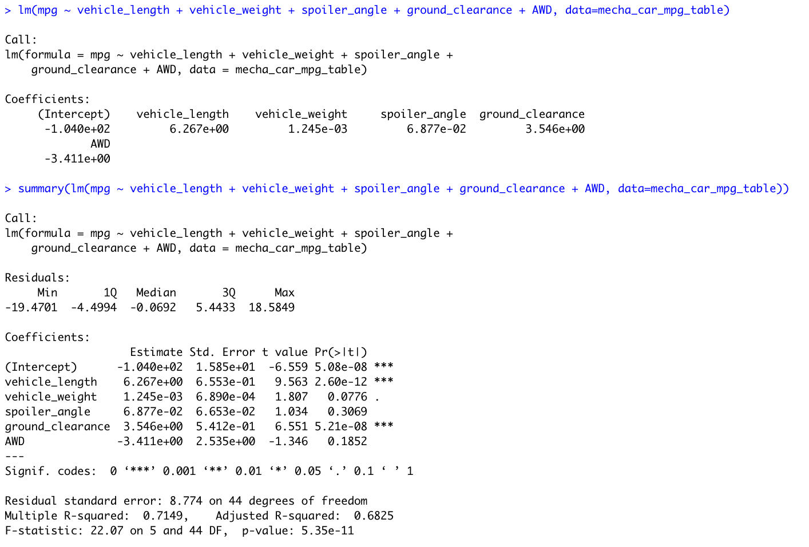

# MechaCar_Statistical_Analysis

## Deliverable 1: Linear Regression to Predict MPG
### Requirements
The MechaCar_mpg.csv is a dataset that shows the results of an mpg test done on 50 MechaCars prototypes. Vehicle length, vehicle weight, spoiler angle, drivetrain, and ground clearance are different metrics that were collected for each vehicle to help MechaCar understand the car performance. In this analysis, the goal is to understand if/ how those metrics can predict mpg.
### Results
 

From the above screenshot the Linear Regression Model is: 
mpg = (6.267)vehicle_length + (0.0012)vehicle_weight + (0.0688)spoiler_angle + (3.546)ground_clearance + (-3.411)AWD + (-104.0)

### Inference
- According to the output, vehicle length and ground clearance are most likely to provie a non-random amount of variance to the mpg values (we can see this from the p-values for the vairables). This means that changing the vehicle length or ground clearance will have an effect on the mpg of a car.  
- In a model like this, our initial hypothesis is that the slope of the model is 0 and the alternate hypothese is that the slope is not zero. Our p-value is 5.35e-11 which is a significant value - this means that we can reject our null hypothesis and accept that the slope of the model is not zero.
- To understand the effective predictability, we need to look at the r-quared value. Our r-squared value is 0.7149 which means that ~71.49% of the mpg values can be predicted by this model. This is a relatively high level of mpg values that can be predicted. At a minimum, it would be helpful to use this model as a base expectation for mpg.

## Deliverable 2: Summary Statistics on Suspension Coils
### Requirements
The Suspension_Coil.csv is a dataset that shows PSI vlaues for multiple manufacturing lots. In this deliverable, we are trying to understand the manufacturing consistency across the different lots.
### Results
Overall Summary:
 

Lot Summary:
 

### Inference
If you only look at the overall summary data, it seems as though MechaCar is hitting its variance goal of less than 100 pounds per square inch (it is 62.29 per square inch). But, upon closer review, each lot has a very different variance which skews the overall numbers. Lot 3 has a very high variance of 170 while Lot 1 and Lot 2 have variances under 10. In fact, if MechaCar looked into the issue in Lot 3, it may be able to reduce the overall variance to be much lower than 62. 

